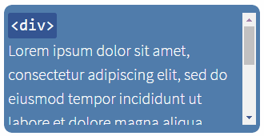
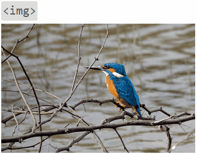
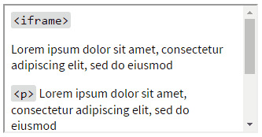

# PlainOverlay

[](https://www.npmjs.com/package/plain-overlay) [](https://github.com/anseki/plain-overlay/issues) [](package.json) [](LICENSE-MIT)

The simple library for customizable overlay which covers all or part of a web page.

**<a href="https://anseki.github.io/plain-overlay/">Document and Examples https://anseki.github.io/plain-overlay/</a>**

[](https://anseki.github.io/plain-overlay/)
[](https://anseki.github.io/plain-overlay/)
[](https://anseki.github.io/plain-overlay/)

**Features:**

- Cover all or part of a web page with an overlay.
- Block scrolling anything under the overlay by a mouse or keys.
- Block focusing anything under the overlay by a mouse or Tab key or access-keys.
- Show something like a loading-animation on the overlay.
- No dependency.
- Single file.
- Modern browsers are supported. (If you want to support legacy browsers such as IE 9-, see [jQuery-plainOverlay](https://anseki.github.io/jquery-plainoverlay/).)

One of the following can be specified as the target that is covered:

- A current window
- An element that has a bounding-box
- Another window (i.e. child window such as `<iframe>`)
- An element in another window

## Usage

Load PlainOverlay into your web page.

```html
<script src="plain-overlay.min.js"></script>
```

This is simplest case:

```js
PlainOverlay.show();
```

Now, new overlay is shown and all of the page are covered with it.  
You can specify an element as the target that is covered.

```js
PlainOverlay.show(element);
```

Use an instance method to hide the overlay.

```js
var overlay = PlainOverlay.show();
// Now, new overlay is shown.
// Do something ...
overlay.hide();
// Now, the overlay is hidden.
```

For options and more details, refer to the following.

## Constructor

```js
overlay = new PlainOverlay([target][, options])
```

The `target` argument is an element that will be covered with the overlay, or `window` (or `document` or `<html>` or `<body>`) that means all of the web page.  
Any element that has a bounding-box is accepted. It can be an element in another window (i.e. `<iframe>`). `<iframe>` is regarded as `window` of that `<iframe>`.  
The default of `target` argument is current `window`.

The `options` argument is an Object that can have properties as [options](#options). You can also change the options by [`setOptions`](#setoptions) or [`show`](#show) methods or [properties](#properties) of the instance.

For example:

```js
// Cover all of the web page, with `duration` option
var overlay = new PlainOverlay({duration: 400});
```

```js
// Cover a part of the web page, with `face` option
var overlay = new PlainOverlay(document.getElementById('form'), {face: false});
```

See also: [`PlainOverlay.show`](#plainoverlayshow)

## Methods

### `show`

```js
self = overlay.show([options])
```

Show the overlay.  
If `options` argument is specified, call [`setOptions`](#setoptions) method and show the overlay. It works the same as:

```js
overlay.setOptions(options).show();
```

See also: [`PlainOverlay.show`](#plainoverlayshow)

### `hide`

```js
self = overlay.hide([force])
```

Hide the overlay.  
If `true` is specified for `force` argument, hide it immediately without an effect. (As to the effect, see [`duration`](#options-duration) option.)

### `setOptions`

```js
self = overlay.setOptions(options)
```

Set one or more options.  
The `options` argument is an Object that can have properties as [options](#options).

### `scrollLeft`, `scrollTop`

```js
currentLeft = overlay.scrollLeft([newLeft[, scrollTarget]])
```

```js
currentTop = overlay.scrollTop([newTop[, scrollTarget]])
```

Scrolling a window or element is blocked while it is covered with the overlay. `scrollLeft` and `scrollTop` methods allow it scroll, and return current value.  
The value is a number of pixels that a content is scrolled to the left or upward.  
The default of `scrollTarget` is a `target` of the overlay.

### `position`

```js
self = overlay.position()
```

Update the position of the overlay that covers a part of a web page.  
If `target` is a part of a web page, the overlay is shown at the same position as the `target`, and it is re-positioned (and resized) as needed automatically when a window that contains the `target` is resized.  
You should call `position` method if you moved or resized the `target` without resizing the window.

## Options

### <a name="options-face"></a>`face`

*Type:* Element, boolean or `undefined`  
*Default:* `undefined` (Builtin Face)

Something that is shown on the overlay. This is usually a message or image that means "Please wait...".  
If `false` is specified, nothing is shown on the overlay.

For example, a message:

```html
<div id="message">Please wait...</div>
```

```js
var overlay = new PlainOverlay({face: document.getElementById('message')});
```

For example, an image:

```html

```

```js
var overlay = new PlainOverlay({face: document.getElementById('image')});
```

For example, an inline SVG:

```html
<svg id="svg" version="1.1">
  <!-- ... -->
</svg>
```

```js
var overlay = new PlainOverlay({face: document.getElementById('svg')});
```

### <a name="options-duration"></a>`duration`

*Type:* number  
*Default:* `200`

A number determining how long (milliseconds) the effect (fade-in/out) animation for showing and hiding the overlay will run.

### <a name="options-blur"></a>`blur`

*Type:* number or boolean  
*Default:* `false`

Applies a Gaussian blur to the `target` while the overlay is shown. Note that the current browser might not support it.  
It is not applied if `false` is specified.

```js
overlay.blur = 3;
```

### <a name="options-style"></a>`style`

*Type:* Object or `undefined`  
*Default:* `undefined`

An Object that can have CSS properties that are added to the overlay.

Major properties of default style:

```js
{
  backgroundColor: 'rgba(136, 136, 136, 0.6)',
  cursor: 'wait',
  zIndex: 9000
}
```

For example, whity overlay:

```js
var overlay = new PlainOverlay({style: {backgroundColor: 'rgba(255, 255, 255, 0.6)'}});
```

Note that some properties that affect the layout (e.g. `width`, `border`, etc.) might not work or those might break the overlay.

If you want to change the default style (i.e. style of all overlay in the web page), you can define style rules with `.plainoverlay` class in your style-sheet.

For example, CSS rule-definition:

```css
.plainoverlay {
  background-color: rgba(255, 255, 255, 0.6);
}
```

### <a name="options-onshow-onhide-onbeforeshow-onbeforehide"></a>`onShow`, `onHide`, `onBeforeShow`, `onBeforeHide`

*Type:* function or `undefined`  
*Default:* `undefined`

Event listeners:

- `onBeforeShow` is called when the overlay is about to be shown. If `false` is returned, the showing is canceled.
- `onShow` is called when a showing effect of the overlay is finished.
- `onBeforeHide` is called when the overlay is about to be hidden. If `false` is returned, the hiding is canceled.
- `onHide` is called when a hiding effect of the overlay is finished.

In the function, `this` refers to the current PlainOverlay instance.

For example:

```js
var overlay = new PlainOverlay({
  onBeforeShow: function() {
    if (name.value) {
      this.face.className = 'anim'; // Start animation
    } else {
      alert('Please input your name');
      return false; // Cancel the showing the overlay.
    }
  },
  onHide: function() {
    this.face.className = ''; // Stop animation
  }
});
```

### `onPosition`

*Type:* function or `undefined`  
*Default:* `undefined`

A `position` event listener that is called when the overlay is shown (before a showing effect starts), a window that contains the `target` is resized, and [`position`](#position) method is called.  
In the function, `this` refers to the current PlainOverlay instance.

This is used to adjust your custom [`face`](#options-face) that depends on a layout of the overlay.

## Properties

### `state`

*Type:* number  
*Read-only*

A number to indicate current state of the overlay.  
It is one of the following static constant values:

- `PlainOverlay.STATE_HIDDEN` (`0`): The overlay is being hiding fully.
- `PlainOverlay.STATE_SHOWING` (`1`): A showing effect of the overlay is running.
- `PlainOverlay.STATE_SHOWN` (`2`): The overlay is being showing fully.
- `PlainOverlay.STATE_HIDING` (`3`): A hiding effect of the overlay is running.

For example:

```js
toggleButton.addEventListener('click', function() {
  if (overlay.state === PlainOverlay.STATE_HIDDEN ||
      overlay.state === PlainOverlay.STATE_HIDING) {
    overlay.show();
  } else {
    overlay.hide();
  }
}, false);
```

### `style`

*Type:* CSSStyleDeclaration  
*Read-only*

A CSSStyleDeclaration object of the overlay to get or set the CSS properties.

For example:

```js
overlay.style.backgroundImage = 'url(bg.png)';
```

### `face`

Get or set [`face`](#options-face) option.

For example, change it while the overlay is shown:

```js
overlay.show({
  face: progressBar,
  onShow: function() {
    setTimeout(function() {
      overlay.face = countDown;
    }, 3000);
  }
});
```

### `duration`

Get or set [`duration`](#options-duration) option.

### `blur`

Get or set [`blur`](#options-blur) option.

### `onShow`, `onHide`, `onBeforeShow`, `onBeforeHide`, `onPosition`

Get or set [`onShow`, `onHide`, `onBeforeShow`, `onBeforeHide`](#options-onshow-onhide-onbeforeshow-onbeforehide), and [`onPosition`](#onposition) options.

## `PlainOverlay.show`

```js
overlay = PlainOverlay.show([target][, options])
```

This static method is a shorthand for:

```js
(new PlainOverlay(target, options)).show()
```

---

Thanks for images: [arian.suresh](https://www.flickr.com/photos/137304541@N04/), [jxnblk/loading](https://github.com/jxnblk/loading/), [The Pattern Library](http://thepatternlibrary.com/), [tobiasahlin/SpinKit](https://github.com/tobiasahlin/SpinKit)
